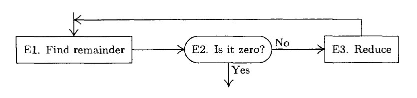
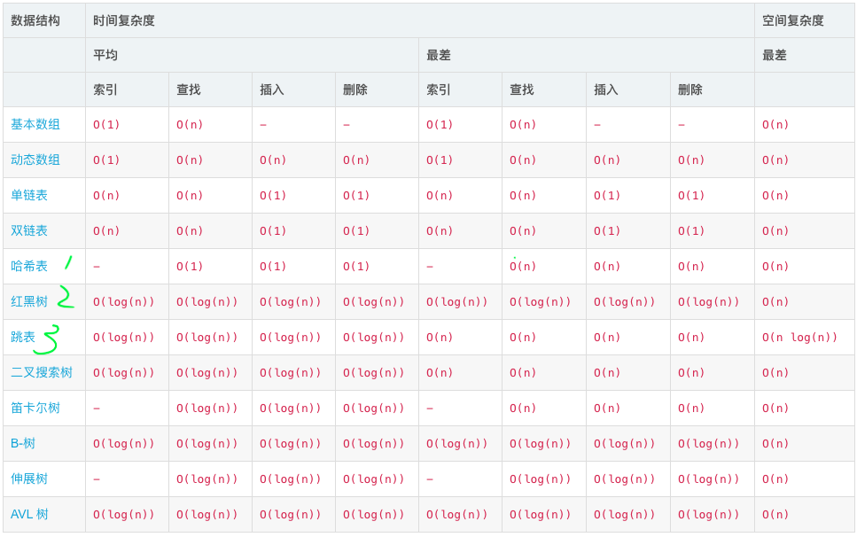
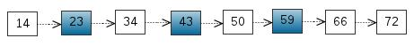
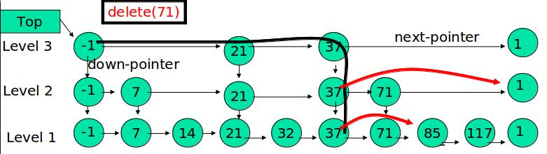

[toc]
## 算法 & 数据结构
$$程序 = 算法 + 数据结构$$
TAOCP中，Donald并没有直接给出“算法”的定义，而是在用了几页的篇幅追溯了一番“Algorithms”这个词的起源以尝试让读者理解它的含义之后，用了欧几里得求解两个正整数最大公因子的例子做阐述：

其中最重要的是→，赋值/代替。
他的学生、红皮算法书的作者-Robert Sedgewick沿用这个例子并尝试给出了一个定义：The term algorithm is used in computer science to describe a **finite**, **deterministic**, and **effective** problem-solving method suitable for implementation as a computer program.
同时指出了二者之间的关系：大多数算法需要适当地组织数据，**为了组织数据就产生了数据结构**。一脉相承的观点是，数据结构是算法的副产品/结果（data structures exist as the byproducts or end products of algorithms）。
<details>
  <summary>数据结构的作用</summary>

## 数据结构的作用
前面说算法需要组织数据，所谓组织，其实就是操作（增、删、改、查）。有关数据结构和算法的课程对中所涉及到的数据结构：数组、链表；以及以前面两者为基础的高级数据结构：堆、树、图；延展开到特定领域/方向上优化的数据结构：各种队列，红黑树，B、B+树，拓扑图等等。
所有的数据结构的目的都是在特定场景下，优化数据的操作效率。可以用算法书给的demo跑一遍十几条排序算法的效率，便能直观感受到，即使在现在这样高性能的计算机面前，$n^2$ → $n\log(n)$所带来巨大效率的提升；而在特定场景下，采用位图、$O(n)$复杂度的排序算法所能带来的更可观的空间、时间上的节省。
绝大多数场景下，我们期待的数据结构是：在保持“有序”的前提下，满足高效的增、删、查操作。其中“有序”是一个相对的概念，堆、单端/双端队列、查找树、拓扑图等，都满足以我们所期待的方式的有序性、或者我们所关心的那部分数据的有序性。

</details>

## 哈希、红黑树、跳表
这里关注K-V型数据结构。
### 合适的数据结构
关注以下速查表数据。

其中，常用的key-value数据结构有三种：
Hash表：插入、查找最快，为$O(1)$；如使用链表实现则可实现无锁；数据有序化需要显式的排序操作。
红黑树：插入、查找为$\log(n)$，但常数项较小；无锁实现的复杂性很高，一般需要加锁；数据天然有序。
SkipList：插入、查找为$\log(n)$，但常数项比红黑树要大；底层结构为链表，可无锁实现；数据天然有序。

* 首先，如果能确定某些数据是静态的，以ACA为例，我们的文案数据目前就可以看成是静态的：可能有描述上的调整，但频次很低，并且数据量不大。这部分数据如果采用直接加载到内存或是中间缓存的话，结构化为HashMap是不错的选择；
* 如前所述，大部分数据操作场景是需要增删改操作的，而非仅仅只有读操作。这里不再讨论堆、队列等使用场景，专注通常情况下的**数据的存取操作**，此时需要兼顾读取、和操作后恢复有序的效率，此时Hash表不再是好的选择：迭代、修改操作的时间复杂度比较高，而红黑树则能很好地满足功能需求；

## 为什么还要有跳表
作为平衡树的一种替代实现，跳表主要拥有以下优势：
* **更简单的实现**
  红黑树增删改元素需要进行旋转、变色，实现起来比较复杂，需要考虑的细节也比较多，到了并发场景下更难以写出可用且高效的红黑树实现；而跳表实现原理相当简单，就是升级版的链表，把链表的某一些元素随机抽出来再组成一个链表，作为一级索引，在该索引集中再次进行抽取，再做一级索引，依次实现多级链表索引，就组成了一个跳表。
  
* **为了解决在高并发下，红黑树的锁实现导致的可能的死锁和并发度降低问题**。
  首先这句话意味着，在单线程、低线程数场景下，红黑树可能是更好的选择：以jdk11为例，ConcurrentHashMap存取速度是ConcurrentSkipListMap的4倍左右，而随着并发的线程数增多，后者的性能优势会逐渐体现出来，它的存取时间复杂度几乎和线程数无关，且无锁开销。

### 特点
上述可见跳表也是一种典型的“空间换时间”的数据结构。其底层采用二维链表，而非通常采用的数组实现。基本特点：
* 由很多层结构组成；
* 每一层都是一个有序的链表；
* 最底层(Level 1)的链表包含所有元素；
* 如果一个元素出现在 Level i 的链表中，则它在 Level i 之下的链表也都会出现；
* 每个节点包含两个指针，一个指向同一链表中的下一个元素，一个指向下面一层的元素。


## 跳表实现
### 构造
考虑一个链表：

从该有序表中搜索元素< 23, 43, 59>，需要比较的次数分别为< 2, 4, 6 >，总共比较的次数为 2 + 4 + 6 = 12 次。
有没有优化的算法？链表是有序的，但不能使用二分查找。类似二叉搜索树，我们把一些节点提取出来，作为索引。得到如下结构：

这里把< 14, 34, 50, 72 >提取出来作为一级索引，这样搜索的时候就可以减少比较次数了。还可以再从一级索引提取一些元素出来，作为二级索引，变成如下结构：


<details>
  <summary>节点类</summary>

```java
    static final class Node<K,V> {
        final K key; // currently, never detached
        V val;
        Node<K,V> next;
        Node(K key, V value, Node<K,V> next) {
            this.key = key;
            this.val = value;
            this.next = next;
        }
    }
```

redis 使用C实现，详见：https://github.com/antirez/redis/blob/unstable/src/server.h
</details>

### 搜索元素
查找元素 117：

1. 比较21，比 21 大，往后面找
2. 比较37，比 37大，比链表最大值小，从 37 的下面一层开始找
3. 比较71，比 71 大，比链表最大值小，从 71 的下面一层开始找
4. 比较85，比 85 大，从后面找
5. 比较117，等于 117， 找到了节点。

<details>
  <summary>搜索</summary>

```java
    private Node<K,V> findNode(Object key) {
        if (key == null)
            throw new NullPointerException(); // don't postpone errors
        Comparator<? super K> cmp = comparator;
        Node<K,V> b;
        outer: while ((b = findPredecessor(key, cmp)) != null) {
            for (;;) {
                Node<K,V> n; K k; V v; int c;
                if ((n = b.next) == null)
                    break outer;               // empty
                else if ((k = n.key) == null)
                    break;                     // b is deleted
                else if ((v = n.val) == null)
                    unlinkNode(b, n);          // n is deleted
                else if ((c = cpr(cmp, key, k)) > 0)
                    b = n;
                else if (c == 0)
                    return n;
                else
                    break outer;
            }
        }
        return null;
    }
```
</details>

### 新增元素
先确定该元素要占据的层数 K（丢硬币，随机），然后在 Level 1 ... Level K 各个层的链表都插入元素：
插入 119， K = 2

其中，然随机变量 K 满足参数为 $p = 1/2$ 的几何分布，期望值 $E[K] = 1/p = 2$。即各个元素的层数，期望值是 2 层。


<details>
  <summary>插入</summary>

```java
    private V doPut(K key, V value, boolean onlyIfAbsent) {
        if (key == null)
            throw new NullPointerException();
        Comparator<? super K> cmp = comparator;
        for (;;) {
            Index<K,V> h; Node<K,V> b;
            VarHandle.acquireFence();
            int levels = 0;                    // number of levels descended
            if ((h = head) == null) {          // try to initialize
                Node<K,V> base = new Node<K,V>(null, null, null);
                h = new Index<K,V>(base, null, null);
                b = (HEAD.compareAndSet(this, null, h)) ? base : null;
            }
            else {
                for (Index<K,V> q = h, r, d;;) { // count while descending
                    while ((r = q.right) != null) {
                        Node<K,V> p; K k;
                        if ((p = r.node) == null || (k = p.key) == null ||
                            p.val == null)
                            RIGHT.compareAndSet(q, r, r.right);
                        else if (cpr(cmp, key, k) > 0)
                            q = r;
                        else
                            break;
                    }
                    if ((d = q.down) != null) {
                        ++levels;
                        q = d;
                    }
                    else {
                        b = q.node;
                        break;
                    }
                }
            }
            if (b != null) {
                Node<K,V> z = null;              // new node, if inserted
                for (;;) {                       // find insertion point
                    Node<K,V> n, p; K k; V v; int c;
                    if ((n = b.next) == null) {
                        if (b.key == null)       // if empty, type check key now
                            cpr(cmp, key, key);
                        c = -1;
                    }
                    else if ((k = n.key) == null)
                        break;                   // can't append; restart
                    else if ((v = n.val) == null) {
                        unlinkNode(b, n);
                        c = 1;
                    }
                    else if ((c = cpr(cmp, key, k)) > 0)
                        b = n;
                    else if (c == 0 &&
                             (onlyIfAbsent || VAL.compareAndSet(n, v, value)))
                        return v;

                    if (c < 0 &&
                        NEXT.compareAndSet(b, n,
                                           p = new Node<K,V>(key, value, n))) {
                        z = p;
                        break;
                    }
                }

                if (z != null) {
                    int lr = ThreadLocalRandom.nextSecondarySeed();
                    if ((lr & 0x3) == 0) {       // add indices with 1/4 prob
                        int hr = ThreadLocalRandom.nextSecondarySeed();
                        long rnd = ((long)hr << 32) | ((long)lr & 0xffffffffL);
                        int skips = levels;      // levels to descend before add
                        Index<K,V> x = null;
                        for (;;) {               // create at most 62 indices
                            x = new Index<K,V>(z, x, null);
                            if (rnd >= 0L || --skips < 0)
                                break;
                            else
                                rnd <<= 1;
                        }
                        if (addIndices(h, skips, x, cmp) && skips < 0 &&
                            head == h) {         // try to add new level
                            Index<K,V> hx = new Index<K,V>(z, x, null);
                            Index<K,V> nh = new Index<K,V>(h.node, h, hx);
                            HEAD.compareAndSet(this, h, nh);
                        }
                        if (z.val == null)       // deleted while adding indices
                            findPredecessor(key, cmp); // clean
                    }
                    addCount(1L);
                    return null;
                }
            }
        }
    }
```
</details>


### 删除元素
采用标准的链表删除即可。
删除 71

<details>
  <summary>删除</summary>

```java
    final V doRemove(Object key, Object value) {
        if (key == null)
            throw new NullPointerException();
        Comparator<? super K> cmp = comparator;
        V result = null;
        Node<K,V> b;
        outer: while ((b = findPredecessor(key, cmp)) != null &&
                      result == null) {
            for (;;) {
                Node<K,V> n; K k; V v; int c;
                if ((n = b.next) == null)
                    break outer;
                else if ((k = n.key) == null)
                    break;
                else if ((v = n.val) == null)
                    unlinkNode(b, n);
                else if ((c = cpr(cmp, key, k)) > 0)
                    b = n;
                else if (c < 0)
                    break outer;
                else if (value != null && !value.equals(v))
                    break outer;
                else if (VAL.compareAndSet(n, v, null)) {
                    result = v;
                    unlinkNode(b, n);
                    break; // loop to clean up
                }
            }
        }
        if (result != null) {
            tryReduceLevel();
            addCount(-1L);
        }
        return result;
    }
```
</details>

## 适用场景
1. jdk从1.6开始引入了两个跳表相关的实现类：ConcurrentSkipListMap、ConcurrentSkipListSet（基于ConcurrentSkipListMap），在jdk中主要是用于高并发场景下代替红黑树的实现，不过从jdk8开始，线程安全的Hash表：ConcurrentHashMap采用了CAS、取消分段锁改用大数组、哈希碰撞超过阈值时树化（红黑树）等手段进一步提升了线程安全Hash表相关实现，性能上也有了很大提升。

2. redis：redis的有序集合zset是采用跳表实现的。分析一下zset所支持的操作就不难理解为啥采用跳表而非红黑树了：
* 插入元素
* 删除元素
* 查找元素
* 有序输出所有元素
* 查找区间内所有元素
  除了易于实现这个因素外。zset所支持的操作中，前4项红黑树都可以完成，且时间复杂度与跳表一致。但是，最后一项，红黑树的效率就没有跳表高了。在跳表中，要查找区间的元素，我们只要定位到两个区间端点在最低层级的位置，然后按顺序遍历元素就可以了，非常高效。而红黑树只能定位到端点后，再从首位置开始每次都要查找后继节点，相对来说是比较耗时的。

3. LevelDB：Google 开源的 key/value 存储引擎 LevelDB 以及 Facebook 基于 LevelDB 优化的 RocksDB 都是 LSM Tree 结构的数据库，内部的 MemTable 使用跳表实现。HBase MemStore 内部存储数据就使用的跳表。为什么呢？HBase 属于 LSM Tree 结构的数据库，LSM Tree 结构的数据库有个特点，实时写入的数据先写入到内存，内存达到阈值往磁盘 flush 的时候，会生成类似于 StoreFile 的有序文件，而跳表恰好就是天然有序的，所以在 flush 的时候效率很高，而且跳表查找、插入、删除性能都很高，这应该是 HBase MemStore 内部存储数据使用跳表的原因之一。HBase 使用的是 java.util.concurrent 下的 ConcurrentSkipListMap()。

4. ES：Lucene核心数据结构采用了跳表实现倒排表。使用FST保存词典，FST可以实现快速的Seek，这种结构在当查询可以表达成自动机时(PrefixQuery、FuzzyQuery、RegexpQuery等)效率很高。(可以理解成自动机取交集)此种场景主要用在对Query进行rewrite的时候。FST可以表达出Term倒排表所在的文件偏移。倒排表使用SkipList结构。从上面的讨论可知，求倒排表的交集、并集、差集需要各种SeekTo(docId)，SkipList能对Seek进行加速。


ref：
https://stackoverflow.com/questions/256511/skip-list-vs-binary-search-tree
https://en.wikipedia.org/wiki/Skip_list
https://blog.csdn.net/sunxianghuang/article/details/52221913
https://www.iteye.com/blog/imtinx-1291165
《algorithms》
《the art of computer programming》