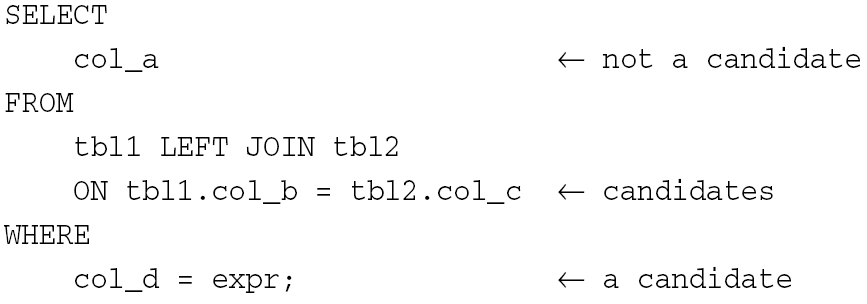

[toc]


**索引是数据库中用来加速查询的最为重要的技术手段。**

# 索引存储：
* 对于 MyISAM 表，其数据保留在数据文件中，索引值保留在索引文件中，即使用数据的物理位置引用被索引的行，并使用前缀压缩技术使得索引更小，一个表可以有多个索引，但它们都保存在同一个索引文件里。索引文件里的每个索引都由一组有序的关键字行构成，这组关键字行主要用于快速访问数据文件；
* 对于 InnoDB 表，默认情况下，只使用一个表空间，用于管理所有的 InnoDB 数据存储和索引存储，也可以修改配置，让它创建的每个表都有自己的表空间，但此时，给定表的数据和索引也同样保存在同一个表空间文件。同样地，InnoDB 将索引值当作一组有序值。InnoDB 存储引擎表是索引组织表，即表中数据按照主键顺序存放，即根据主键引用被索引的行。

## 高效索引
并非在所有的查询条件中出现的列都需要添加索引。对于添加 B+ 树索引的一般经验是，**在访问表中很少一部分时考虑使用 B+ 树索引**。
如果一个字段取值范围很广，重复出现较少，即属于高选择性字段，此时使用 B+ 树索引比较合适。否则，如性别、类型等字段，可取值范围很小（性别显然只能筛选 50%），即属于低选择性字段，此时不适合使用 B+ 树索引。事实上，在低选择性的字段上，即使建立了如 B 树索引，数据库可能也不会使用，而是仍然以全扫描（如果没有其他可用索引）的方式进行查找，因为此时使用这种索引可能反而降低性能。

### 指导原则
* **为用于搜索、排序、分组的列创建索引，而对于用作输出显示的列不需要建立索引**。
即，最佳索引候选列是出现在 WHERE、连接、ORDER BY、GROUP BY 子句中的列，而出现在 SELECT 关键字后面的输出列表里的列则不是很好的选择。


* **认真考虑数据列基数**
列的基数（cardinality）是指它所容纳的所有非重复值的个数。相对于表的总行数来说，列的基数越大（也就是包含的唯一值越多，重复值越少，即上述的高选择性的列），使用索引的效果越好。

* **索引短小值**
应尽量选择较小的数据类型。如，当使用 MEDIUMINT 列便能够容纳所需要存储的数据时，就不要选用 BIGINT，如果值的长度都不会超过 25 个字符，那么就不要使用 CHAR(100)。短小的值可以提高索引的处理性能：
> 短小的值操作更快，从而加快索引查找速度；
> 短小的值可以让索引更小，从而减少磁盘 I/O；
> 对于短小的键值，键缓存里的索引块可以容纳更多的键值，也就可以在更少的磁盘 I/O 下读取更多的索引块，从而提高找到键值的几率。

* **索引字符串值的前缀**
要对字符串列建立索引，应该尽可能指定前缀长度。如，对于一个 CHAR(200) 列，如果大多数值的前 10 个 或 20 个字符都是唯一的，那么就可以不用为整个列进行索引，而只为前 10 个或 20 个字符进行索引，这样可以节省大量的索引空间，而且能够加速查询；但只索引列的第一个字符恐怕不行，因为会导致索引无法获得大量的唯一值。

* **利用最左前缀**
当创建包含 n 个列的复合索引时，实际上会创建 n 个索引，即相当于多个索引，因为索引中最左边的任意数据列集合都可以用于匹配各个行。这样的集合即为 **最左前缀**。
假设：多个列的复合索引中包含列：county、state、city，索引中行的排列顺序为 country/state/city。那么，行首先会按照 county/state 顺序排序，然后按 country 顺序排序，这意味着，即使在查询中只指定了 county 值，或者只指定了 country 和 state 值，MySQL 也可以充分利用索引。因此，索引可用于搜索这些列组合：
country, state, city
country, state
country
对于没有包含最左前缀的搜索，如按照 state 或者 city 来搜索，MySQL 则无法使用该索引；而如果要所搜 country 和 city（索引的第 1、3 列，跳过第 2 列），那么索引能够找到与 country 匹配的行以缩小搜索范围，但无法继续用于 city 列。

* **不要建立过多的索引**
显然，索引的建立并非无代价的，要考虑对性能和存储的影响。过多的索引也会导致

* **选择合适的索引类型**
对于精确查找（使用 =、<> 的查找），那么使用 MEMORY 的默认索引类型，即 hash 索引，可能效果更好：hash 的精确查找速度非常快，而对范围匹配表现欠佳；所以对于范围查找，使用 B+ 树类型的索引效果更好，InnoDB、MyISAM、MEMORY 等都支持 B 树索引。

* **利用慢查询日志找出性能低劣的查询**
参见“慢查询日志”部分。

### 辅助手段
为数据选择利于高效查询的数据类型。
**多用数字运算，少用字符串运算**
数字运算通常比字符串运算更快。尽可能使用数字表示数据，如以点记号表示的 IP 地址，可以采用 4 组数字依次存入 INT UNSIGNED，而非直接使用字符串，尽管更方便，但数字对数据操作更高效，且更加节省空间。

**把数据列声明为 NOT NULL**
这可以加快查询，因为查询处理期间不再需要检查该列的值是否可以为 NULL，也有利于编写更简洁的 sql 语句。如果必须考虑 NULL 的情况，也可以考虑默认值等方式。

**考虑使用 ENUM 列**
如果必须采用字符串的列，恰好其基数很小（差异值较少），可以考虑转用 ENUM 列，即内部实际上采用数字形式存储，从而获得数字运算的处理速度。

**使用 PROCEDURE ANALYSE()**
运行 PROCEDURE ANALYSE()，可以根据输出得出一些优化手段。

**整理表碎片**
对频繁修改的表，尤其是包含可变长数据列的表，往往会产生大量碎片，导致空间浪费。定期使用 OPTIMIZE TABLE，可以消除/减少碎片化的 InnoDB、MyISAM 表的空间浪费，并有助于防止性能降低。适用于各存储引擎的碎片整理方式是：先用 mysqldump 转储表，再利用该转储文件重建之：
```sql
mysqldump db_name table_name > dump.sql
mysql db_name < dump.sql
```

**压缩数据**
把数据压缩到 BLOB 或 TEXT 列。使用 BLOB 或 TEXT 列来存储那些可以在应用程序中对其进行压缩和解压的数据，使之能够使用单个索引操作找出所有内容的目的。这种方法特别适用于存储那些难以用标准表数据结构表示的数据，或者会随时间变化的数据。

**把 BLOB 或 TEXT 列剥离处出来形成一个单独的表**
将 BLOB 或 TEXT 列单独存入一个附表，可以更好地管理原表里的数据。

**一个索引是否适合某个查询的“三星系统”**
* 索引将相关的记录放到一起则获得一星；
* 索引中的数据顺序和查找中的排练顺序一致则获得二星；
* 索引中的列包含了查询中需要的全部列则获得三星。

## 索引使用方式
* 加快对 WHERE 字句匹配的行进行搜索的速度/加快对与另一个连接表里的行匹配的行进行搜索的速度；
* 对于使用 MIN() 或 MAX() 函数的查询，可以在不用逐行检查的情况下，快速找到索引列里的最值；
* 对于 ORDER BY 和 GROUP BY 字句，MySQL经常使用索引来高效地完成分类/分组操作；
* 通过索引来读取查询所请求的所有信息。

# 索引类型
InnoDB 存储引擎支持的类型有 3 种：B+ 树索引、全文索引、哈希索引。其中，哈希索引是自适应的，InnoDB 存储引擎会根据表的使用情况自动为表生成哈希索引，不能人为干预该过程。
另外，还有一种 MySQL 不支持但很常见（如 Oracle）的索引：位图索引（BitMap BitMap index）。从这个开始。

## 位图索引
上面提到建立 B 树索引的条件：高选择性的列。对于低选择性的列（这里应该描述成：只有固定几个值可选的列）如性别、婚否等，位图索引可能是个好的选择。示例：


### 适用条件
* 只有几个固定值的列；
* 不会频繁更新；

[位图索引原理](https://www.cnblogs.com/LBSer/p/3322630.html)

## B+ 树索引（InnoDB）
B+ 树是为磁盘或其它直接存取辅助设备设计的一种平衡查找树。目前关系型数据库系统中查找最为常用和最为有效的索引。
**特点**
由于 B+ 索引在数据库中有 **高扇出性** 的特点，一般高度在 2-4 层，意即查找某一键值的行记录最多只需要 2-4 次 I/O。
**B+ 树索引并不能找到一个给定键值的具体行，而是查找该行所在的页，然后通过把页读入内存，再在内存中进行查找，最后得到要查找的数据行**。
可以分为聚集索引（Clustered Index）和辅助索引（Secondary Index），叶子节点存放着所有的数据，不同之处是，叶子节点存放的是否是一整行的信息。

### 聚集索引（clustered index）/聚簇索引
按照每张表的主键构造一棵 B+ 树，同时叶子节点中存放的即为整张表的行记录数据，也将聚集索引的叶子节点成为数据页。聚集索引的这个特性决定了索引组织表中数据也是索引的一部分。同 B+ 树数据结构一样，每个数据页都通过一个双向链表来进行链接。由于实际的数据页只能按照一棵 B+ 树进行排序，因此每张表只能拥有一个聚集索引。查询优化器倾向于采用聚集索引，因为能够在叶子节点上直接找到数据，对于主键的排序查找和范围查找速度都非常快。聚集索引的存储并不是物理上连续的（维护成本将非常高），而是逻辑上连续的。

### 辅助索引/非聚簇索引
叶子节点并不包含行记录的全部数据，除了包含键值以外，每个叶子节点的索引行中还包含了一个书签，用来告诉InnoDB存储引擎哪里可以找到与索引相对应的行数据。辅助索引的存在并不影响数据在聚集索引中的组织，因此每张表上可以有多个辅助索引。当通过辅助索引来查找数据时，InnoDB存储引擎会遍历辅助索引并通过叶级别的指针获得指向主键索引的主键，然后通过主键索引来找到一个完整的行记录。
*例：如果在一棵高度为3的辅助索引树中查找数据，那么需要对这棵辅助索引树遍历3次找到指定主键，如果聚集索引树的高度同样为3，那么还需要对聚集索引树进行3次查找，最终找到一个完整的行数据所在的页，因此共需要6次逻辑IO访问以得到最终的一个数据页。*

### 为什么使用 B+ 树数据结构
* 数据库索引一般数据量很大，超出了内存范围，这时候传统的内存数据结构比如红黑树不再适用，而 B+ 树更适合磁盘数据结构，它通过降低树的高度，来减少磁盘操作，从而提高查询效率。
* Mysql 是一种关系型数据库，区间访问是常见的一种情况，B+ 树叶节点增加的链指针,加强了区间访问性，可使用在范围区间查询等，而 B- 树每个节点 key 和 data 在一起，则无法区间查找。

### B 树索引的限制：
* 如果不是按照索引的最左列开始查找，则无法使用该索引；
* 不能跳过索引中的列。即，如果一个索引中含有三个列，则只有在使用了第一、二列的情况下，才能使用第三列；
* 如果查询中有某个列的范围查询，则其右边所有列都无法使用索引查找。如果范围查询列值的数量有限，可以通过使用多个等于条件替代之。
etc.

## 哈希索引（Hash Index）
基于哈希表实现，只有精确匹配索引所有列的查询才有效。对于每一行数据，存储引擎都会对所有的索引列计算一个哈希码（Hash Code），哈希码是一个比较小的值，并且不同键值的行计算出来的哈希码是不同的。哈希索引将所有的哈希码存储在索引中，同时在哈希表中保存指向每个数据行的指针。

MySQL中，只有 Memory 引擎显式支持哈希索引，也是 Memory 引擎表默认索引类型，并且支持非唯一哈希索引。如果多个列的哈希值相同，索引会以链表的方式存放多个记录指针到同一个哈希条目中；
InnoDB 引擎支持的哈希索引是自适应的，会根据表的使用情况自动为表生成哈希索引，不能人为干预是否在一张表中生成哈希索引。

## 全文索引（Full-Text Search Index)
**将存储于数据库中的整本书或整篇文章中的任意内容信息查找出来的技术。**
_MyISAM支持全文索引，InnoDB 从 1.2.x 版本开始支持全文索引。Memory、NDB、Archive等不支持全文索引。_

### 倒排索引
全文索引通常使用倒排索引（Inverted Index）来实现：在辅助表（Auxiliary Table）中存储了单词与单词自身在一个/多个文档中所在位置之间的映射，这通常利用关联数组实现，有两种表现形式：

* Inverted File Index，表现形式为 {单词，单词所在文档 ID}；
* Full Inverted Index，表现形式为{单词，（单词所在文档 ID，在具体文档中的位置1，位置2...）}
示例如下：

### InnoDB 全文索引
采用 Full Inverted Index 的方式，将（DocumentId， Position1, Position2...）视为一个 ilist。故在全文索引的表中，有两个列：word字段、ilist字段，并且在word字段上设有索引。此外，由于 InnoDB 在ilist字段中存放了 Position 信息，故可以进行 Proximity Search（MyISAM不支持该特性）。
为提高全文检索的**并行性能**，InnoDB中共有6张 Auxiliary Table，目前每张表根据 word 的 Latin 编码进行分区。Auxiliary Table 是存放在磁盘上的持久表。此外，还有一个 FTS Index Cache（全文检索索引缓存），用来提高全文检索的行能。它是一个红黑树结构，根据（word，ilist）进行排序。

### 限制：
* 每张表只能有一个全文索引的索引；
* 由多列组合而成的全文索引的索引列必须使用相同的字符集和排序规则；
* 不支持没有单词界定符（delimiter）的语言，如中、日、韩等语言。

### 相关性：
在 WHERE 中使用 MATCH 函数，查询返回的结果是根据相关性（Relevance）进行降序排序的，即相关性最高的结果放在第一位，0表示没有任何相关性。计算条件：

* word是否在文档中出现；
* word在文档中出现的次数；
* word在索引列中的数量；
* 多少个文档包含该word。

### BOOLEAN
全文检索可以使用 IN BOOLEAN MODE 修饰符，此时查询字符串的前后字符会有特殊的含义，如：
* \+ word：表示word必须存在；
* \- word：表示word必须被排除；
* @distance：可选，表示字符字节间距最大值；
* \>：表示出现该词时增加相关性；
* <：表示出现该词时降低相关性；
* \*：表示以该词开头的单词，如lik*，可以是lik、like、likes...
* “：表示短语；
* ~：表示允许出现该单词，但相关性为负
* etc.

### Query Expansion
全文索引的扩展查询，通常在查询的关键词太短，用户需要 implied knowledge（隐含知识）时进行。如，对于单词 database 的查询，用户可能希望查询的不仅仅是 database 的文档，可能还指那些包含 MySQL、Oracle、DB2、RDBMS 等的单词，这时可以使用 Query Expansion 模式来开启全文索引的 implied knowledge。
通过在查询短语中添加 WITH QUERY EXPANSION 或 IN NATURAL LANGUAGE MODE WITH QUERY EXPANSION 可以开启 blind query expansion（automatic relevance feedback）。该查询分为两个阶段：
1. 根据索引的单词进行全文索引查询；
2. 根据第一阶段产生的分词再进行一次全文检索的查询。

由于 Query Expansion 的全文检索可能带来许多非相关性的查询，因此在使用时需要非常谨慎。

# 索引代价
主要体现在索引导致的写操作效率降低和空间占用两方面。

## 降低写操作效率
写入操作（插入、删除、更新等）同时需要更新索引，所以表上的索引越多，需要做出的索引修改操作越多。所以在写操作频繁的表中，需要一些优化措施。

## 占用空间
索引会占用磁盘空间，尤其在多个索引的表中，索引可能导致很快达到表大小上限，这跟具体存储引擎有关：
* InnoDB 中，使用独立表空间的表，索引 + 数据行有文件大小限制，受操作系统影响；使用系统表空间则所有表和索引共享同一个存储空间池，添加索引会使存储空间减少得很快，但总大小不受操作系统的影响，逻辑上可以配置多个文件，所以可以使用磁盘扩容表空间。
* MyISAM 中，大量的索引可能导致索引文件比数据文件更快达到文件大小的上限。


# Q&A
_为什么不直接对数据进行排序呢？这样就不需要索引了而且能够加速搜索_
如果表只有一个索引，自然可以这样做。如果想添加两个/多个索引，又不能同时按照两种方式对数据进行排序，比如一个关于顾客姓名的索引和一个电话号码索引，这种情况就无法排序。将索引从数据行中整体分离出来，就可以创建多个索引，并且不需要对原始数据排序，但搜索过程即先在索引中找到对应值，然后根据匹配的记录找到对应的数据行。此外，索引行数据通常比表里的数据行更短，插入/删除值时，为保持排序顺序，来回移动较短的索引值，比来回移动较长的数据行更加容易。