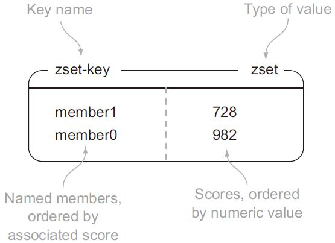

[toc]
**re**mote **di**ctionary **s**erver, redis, 是一个开源的内存中的数据结构存储系统，它可以用作：**数据库、缓存和消息中间件**。采用 **单进程单线程** 方式运行。
Redis 支持多种类型的数据结构，如字符串（Strings），散列（Hash），列表（List），集合（Set），有序集合（Sorted Set或者是ZSet）与范围查询，Bitmaps，Hyperloglogs 和地理空间（Geospatial）索引半径查询。其中常见的数据结构类型有：String、List、Set、Hash、ZSet这5种。
[redis 教程](https://www.runoob.com/redis/redis-intro.html)

# 查询速度
Redis 采用基于内存的、单进程单线程模型的 KV 数据库，由 C 语言编写。官方提供的数据是可以达到 100000+ 的 QPS（每秒内查询次数）。

## 高效查询的原因
* 纯内存操作，绝大部分请求是纯粹的内存操作，非常快速。数据存在内存中，类似于 HashMap，HashMap 的优势就是查找和操作的时间复杂度都是O(1)；
* 数据结构简单，对数据操作也简单，Redis 中的数据结构是专门进行设计的；
* 采用单线程，避免了不必要的上下文切换和竞争条件，也不存在多进程或者多线程导致的切换而消耗 CPU，不用去考虑各种锁的问题，不存在加锁释放锁操作，没有因为可能出现死锁而导致的性能消耗；
* 使用多路 I/O 复用模型，非阻塞 IO；
* 底层模型不同，Redis 直接构建了专用的 VM 机制，因为一般的系统调用系统函数的话，会浪费一定的时间去移动和请求。

## 单线程的问题
首先要明确，这里单线程是指，Redis 只使用一个线程来处理网络请求，而一个 Redis Server 处于运行状态时还是有多个线程的，比如用于持久化的子线程/子进程。此外，进入 4.0 版本后，某些操作上开始支持多线程执行，不排除后续版本将整个服务都采用多线程的可能。
**显然，单线程无法发挥多核的优势，通常在单机开启多个 Redis 实例以充分利用多核环境资源**。
[为什么说Redis是单线程的](https://mp.weixin.qq.com/s/hCNUqpQAQI4Vu3HRi9ZKnA)

## 基于 Key-Value 的 NoSQL 内存数据库
也称数据结构服务器。
特点和优势：
* 支持数据的持久化，可以将内存中的数据持久化到磁盘中，重启时再次加载使用；
* 不仅支持简单的 key-value 类型数据，同时还提供 list、set、zset、hash 等数据结构的存储；
* 支持数据备份，即 master-slave 模式的数据备份；
* 性能极高：读的速度是110000次/s,写的速度是81000次/s；
* 丰富的数据类型，提供了5种数据结构：String、List、Hash、Set、Ordered Set（ZSet）；
* 原子操作：Redis 的所有操作都是原子性的，同时还支持对几个操作全并后的原子性执行；
* 丰富的特性：支持 publish/subscribe、通知 key 过期等特性。

## 数据结构


### string
类似于其他编程语言中字符串的概念。
redis 中的 string 类型是二进制安全的，i.e. 可以包含任何数据，比如一张 .jpg 格式的图片。一个键最大存储量为 512 MB。


### list
按照插入顺序有序存储多个字符串，相同元素可重复，双向操作（LPHSH、LPOP、RPUSH、RPOP）。
每个 list 最多存储元素数量：2^32 - 1。


### set
集合和列表都可以存储多个字符串，不同之处在于：列表可以存储多个相同的字符串，集合通过 **散列表来保证存储的每个字符串都是不相同的**。
redis 的集合使用无序（unordered）方式存储元素，不支持像列表一样将元素从某一端 push/pop 的操作，相应地，使用 SADD/SREM 添加/移除元素。由于是通过哈希表实现的，所以添加/移除/查找的时间复杂度为 O(1)。
每个 set 最多存储元素数量：2^32 - 1。


### hash
可以存储多个键值对之间的映射。**官方推荐：尽可能使用hash存储数据。**
每个 hash 最多存储键值对数量：2^32 - 1。


### zset
有序集合（zset）和散列一样，都用于存储键值对，不支持重复元素。不同之处在于：有序集合的键被称为成员（member），每个成员都是各不相同的；值被称为分值（score），必须为浮点数（分值可重复）。zset 既可以根据成员访问元素（和散列一样），又可以根据分值以及分值的排列顺序来访问元素的结构。
每个 zset 最多存储键值对数量：2^32 - 1。

# use case
## 作为分布式锁
分布式锁至少要满足三个属性要求：  
* 安全方面（Safety property）：互斥。在任一时刻，只有一个client可以获取锁；
* 活性A（Liveness property）：无死锁。即便持有锁的client崩溃（crashed)或者网络被分裂（gets partitioned)，锁仍然可以被获取；
* 活性B（Liveness property）：容错。只要多数Redis节点活着，client就可以获取和释放锁。

参见 [redlock](https://redis.io/topics/distlock)

## 作为LRU缓存
redis提供多种key淘汰机制：  
* noeviction: 不淘汰，当超过内存限制，抛出异常；
* allkeys-lru: 在所有键中，选取最近最少使用的数据抛弃；
* volatile-lru: 在设置了过期时间的所有键中，选取最近最少使用的数据抛弃；
* allkeys-random: 在所有键中，随机抛弃；
* volatile-random: 在设置了过期时间的所有键中，随机抛弃；
* volatile-ttl: 在设置了过期时间的所有键中，抛弃存活时间最短的数据；  
_4.0 新增：_
* allkeys-lfu: 在所有键中，选取使用频率最少的数据抛弃；
* volatile-lfu: 在设置了过期时间的所有键中，选取使用频率最少的数据抛弃；

# Persistence
redis提供不同的持久化选项：  
* RDB: 在指定的时间间隔内将内存中的数据集快照写入磁盘；
* AOF(append only file): 将server接收到的每个操作日志以追加的方式写入文件；

# 多线程
6.0版本开始支持多线程。
